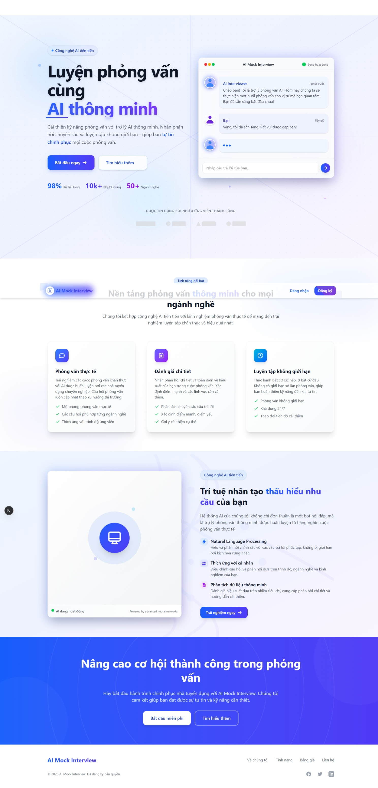
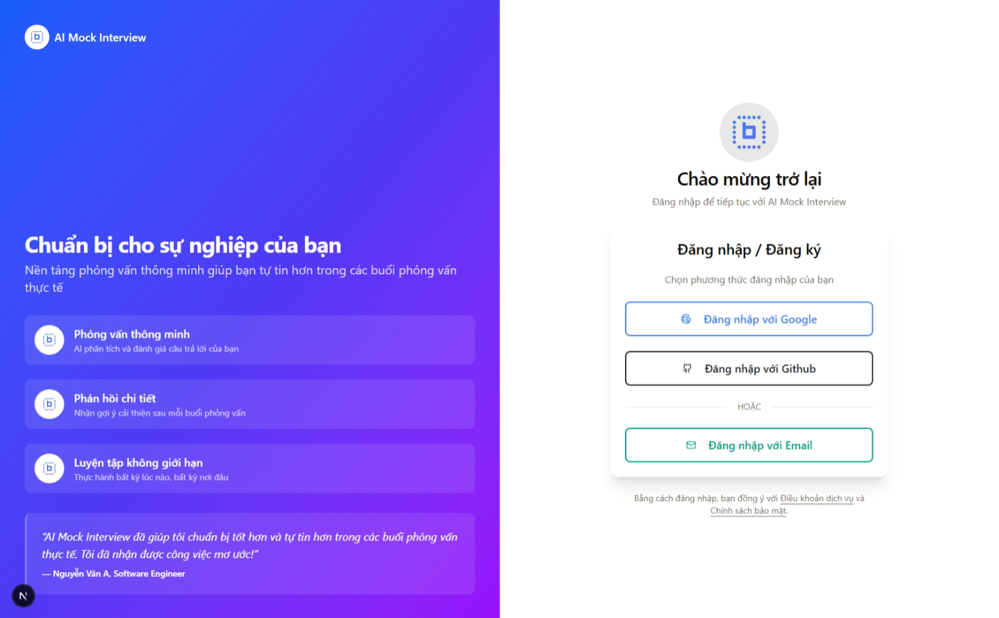
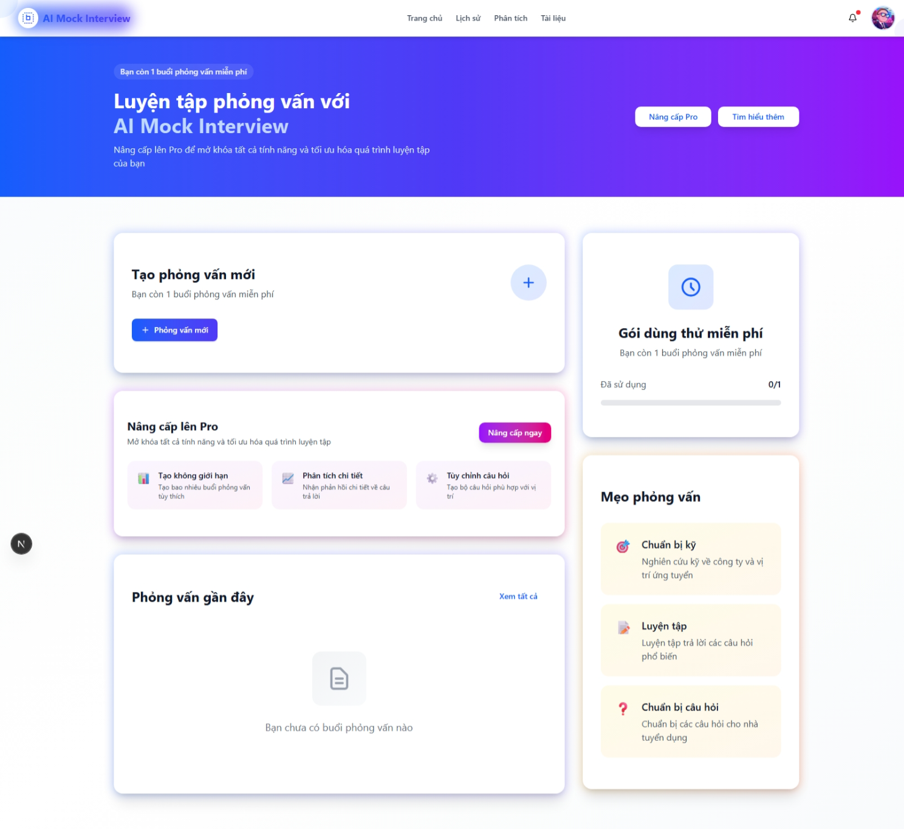
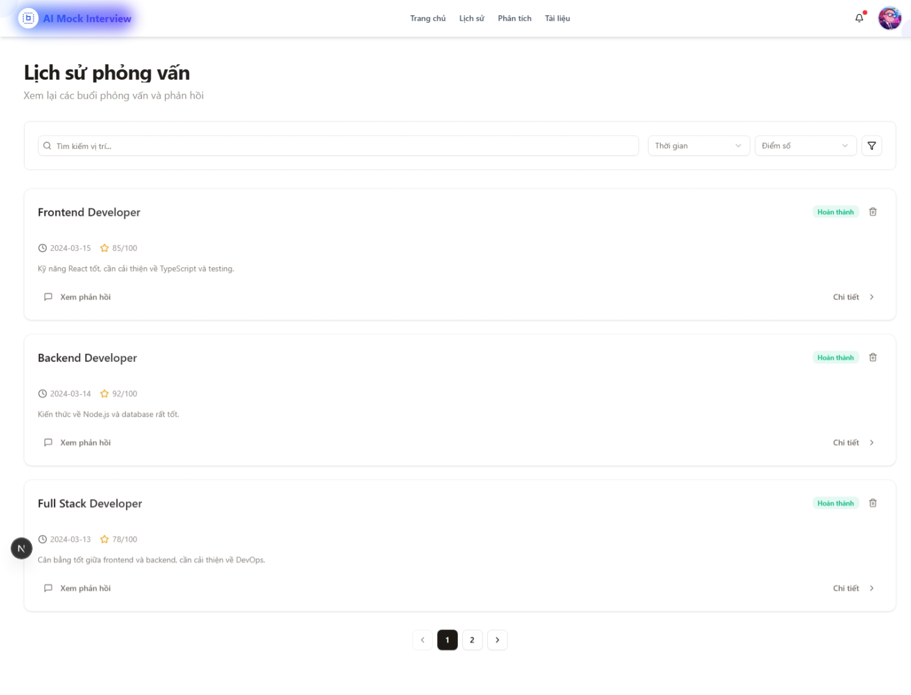
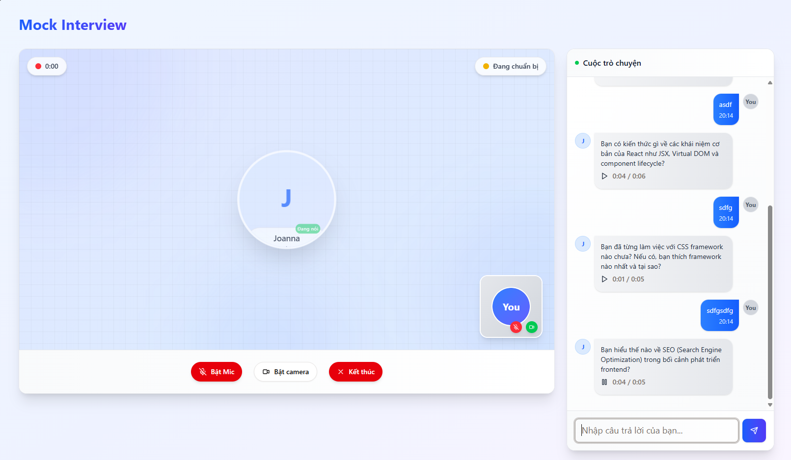

# AI Mock Interview

# Vui lòng liên hệ với tôi mở API dịch vụ để có thể test web. Cám ơn vì đã đọc!

## 1. Giới thiệu

AI Mock Interview là một ứng dụng web hiện đại được thiết kế để giúp người dùng thực hành và cải thiện kỹ năng phỏng vấn của mình. Ứng dụng sử dụng công nghệ AI tiên tiến để tạo ra trải nghiệm phỏng vấn thực tế, nơi người dùng có thể:

- Thực hành phỏng vấn với AI thông minh
- Nhận phản hồi chi tiết về hiệu suất
- Theo dõi sự tiến bộ qua thời gian
- Tương tác trong môi trường phỏng vấn chuyên nghiệp

Với giao diện thân thiện và công nghệ AI mạnh mẽ, AI Mock Interview là công cụ lý tưởng cho những ai muốn chuẩn bị cho các buổi phỏng vấn thực tế.

## 2. Ảnh demo

Trang chủ


Đăng nhập / Đăng ký


Bảng điều khiển


Lịch sử phỏng vấn


Phòng phỏng vấn


## 3. Tính năng chính

- **Xác thực người dùng:** đăng nhập, đăng ký, quên mật khẩu
- **Phỏng vấn với AI:**
  - Tạo phòng phỏng vấn mới
  - Trả lời các câu hỏi
  - Đánh giá hiệu suất
  - Nhận phản hồi chi tiết
- **Quản lý lịch sử:**
  - Xem lại các buổi phỏng vấn
  - Theo dõi tiến độ
  - Phân tích kết quả

## 4. Công nghệ sử dụng

**Frontend**
- Next.js 14
- TypeScript
- Tailwind CSS
- Shadcn/ui
- React Hook Form
- Zustand (State Management)

**Backend**
- Node.js
- Nextjs.js
- Postgres

**AI & ML**
- GeminiAI 
- XTTS
- Whisper-large-v3-turbo

**Authentication**
- JWT
- Passport

## 5. Cài đặt và chạy

1. Clone repository:
```bash
git clone [repository-url]
```

2. Cài đặt dependencies:
```bash
cd ai-mock-interview
npm install
```

3. Tạo file .env.local và cấu hình các biến môi trường:
Chú ý file .env.example 

4. Chạy ứng dụng:
```bash
npm run dev
```

## 6. Đóng góp

Mọi đóng góp đều được hoan nghênh. Với những thay đổi lớn, vui lòng tạo issue trước để thảo luận về những gì bạn muốn thay đổi.
